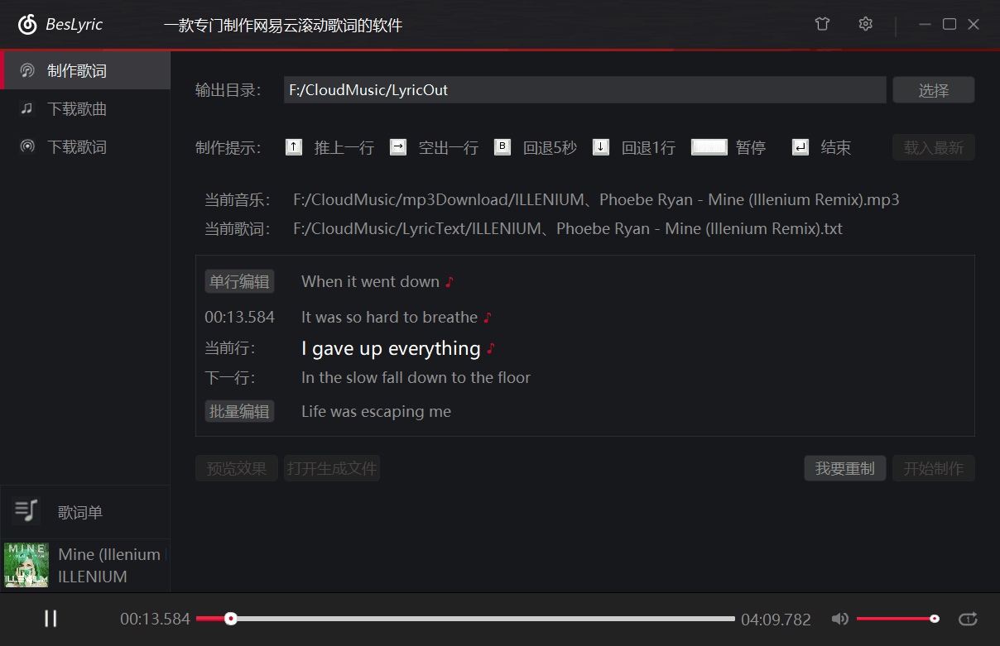



[](https://996.icu/#/zh_CN)
[](https://github.com/BesLyric-for-X/BesLyric-for-X/releases/latest)
[](https://gitter.im/BesLyric-for-X_org/community?utm_source=badge&utm_medium=badge&utm_campaign=pr-badge)
[](https://shang.qq.com/wpa/qunwpa?idkey=90548f8500d6f5b5fd9b6ee89684206053b709b6309a0dc807cdb4cd8704a78e)

# BesLyric-for-X



## 简介

BesLyric-for-X 是一款操作简单、功能实用的歌词制作软件。云村的村民们能够在网易云风格的界面中获得良好的歌词制作体验。

本软件的设计和开发源自 [BesLyric](https://github.com/BesLyric-for-X/BesLyric) ，它只能运行在 Windows 中。为了 Linux 和 macOS 的用户，我们基于 Qt 框架开发了 BesLyric-for-X 。

经过测试，本软件可在下列操作系统中正常运行：

- Linux (64-bit, glibc>=2.27, glib2<2.70):
  - Deepin:
    - 20.2
  - Ubuntu:
    - 18.04.6 (gnome-shell 3.28.4)
    - 20.04.2 (gnome-shell 3.36.4)
  - Debian:
    - 10.9 (gnome-shell 3.30.2)
    - 11.0 (gnome-shell 3.38.4)
  - CentOS:
    - 8.2.2004 (gnome-shell 3.32.2)
  - Fedora:
    - 32 (gnome-shell 3.36.1)
  - Manjaro:
    - 20.0.3 (xfdesktop 4.14.2)
- macOS (64-bit):
  - 10.13.6 (17G65)
  - 10.14.6 (18G84)
  - 10.15.7 (19H2)
  - 11.1 (20C69)
  - 11.5.2 (20G95)
- Windows (32-bit & 64-bit):
  - 7 (6.1.7600)
  - 8.1 (6.3.9600)
  - 10:
    - 21H1 (10.0.19043.1110)
  - 11:
    - 21H2 (10.0.22000.194)

经过测试，本软件可在使用下列显示设置的桌面环境中正常运行：

| 分辨率 | DPI 缩放等级
|:- | -:
| 2560x1440 (QHD) | 100%
| 3840x2160 (4K UHD) | 100%
| 3840x2160 (4K UHD) | 200%
| 5120x2880 (5K UHD) | 100%
| 5120x2880 (5K UHD) | 200%

请访问[这篇博文](http://www.cnblogs.com/BensonLaur/p/9695769.html)查看使用教程或可能遇到的问题。

BesLyric-for-X 所使用的程序图标来自 [Netease Cloudmusic icons - OPPO Color OS Icons - Easyicon](https://www.easyicon.net/1186871-netease_cloudmusic_icon.html) 。

## 开发说明

### 获取源代码

```console
$ git clone --recurse-submodules https://github.com/BesLyric-for-X/BesLyric-for-X.git
$ #         \--------__--------/
$ #              Important!
```

### 环境

框架：

- Qt 5.12.4+

操作系统：

- Linux ([Qt for Linux/X11 | Qt 5 § Supported Configurations](https://doc.qt.io/qt-5/linux.html#supported-configurations))
  - Ubuntu 18.04+
  - Fedora release 32
  - Manjaro Linux xfce 20.0.3
  - openSUSE Leap 15.2
- macOS 10.14 & 10.15 ([Qt for macOS | Qt 5 § Supported Versions](https://doc.qt.io/qt-5/macos.html#supported-versions))
- Windows 10 ([Qt for Windows | Qt 5 § Supported Configurations](https://doc.qt.io/qt-5/windows.html#supported-configurations))

工具链：

- Linux: GCC 5+
- macOS: Xcode 11+ (Command Line Tools (CLT) only)
- Windows
  - MSVC 2017+
  - MinGW 7.3.0+

本项目依赖这些第三方库：

- FFmpeg 4
- SDL 2
- OpenSSL 1.1.1

### 构建

请按照 [BesLyric-for-X/BesLyric-for-X_Conf](https://github.com/BesLyric-for-X/BesLyric-for-X_Conf) 进行开发环境的配置，再进行构建。

#### Linux 或 macOS

```console
$ qmake && make
```

#### Windows

```console
> qmake -before "B4X_DEP_PATH=C:\b4x-lib"

> nmake         # MSVC
> mingw32-make  # MinGW
```

### 部署与打包

请参考 [.deploy-package](.deploy-package/) 文件夹中的内容。
